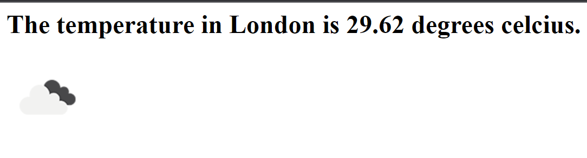
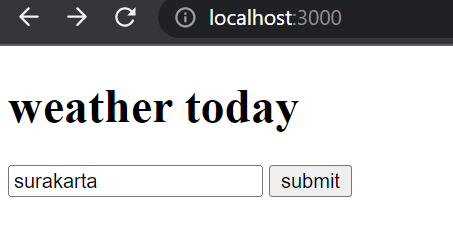
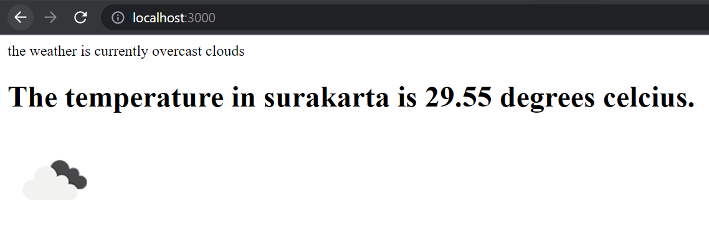
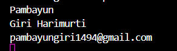
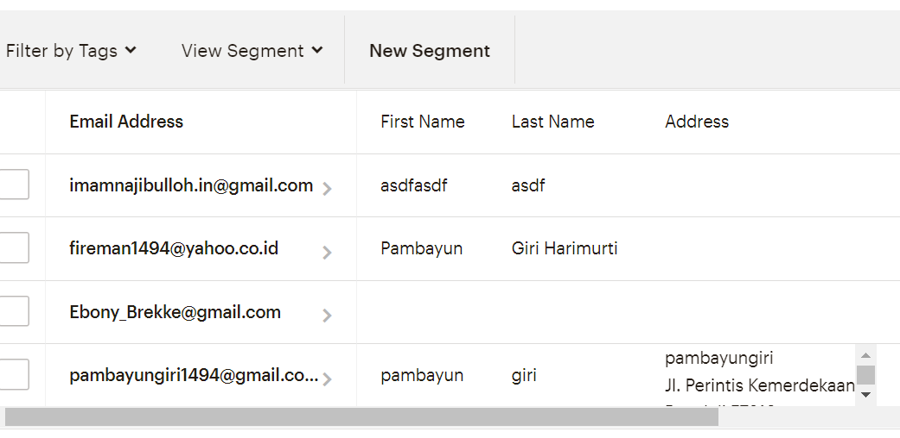

# UDEMY ANGELA WEB DEVELOPMENT

## section 14 : jQuery

---

---

### 177. what is jQuery?

---

jQuery is a library, a bunch of code that somebody else code so we can use it to make life easier

for example:

`document.querySelector(“h1”) >>> jQuery(“h1”) >>>> $(“h1”)`

### 176. how to incorporate to our website

---

[www.jquery.com](https://www.jquery.com)

you can download all the jquery code file or CDN

The most popular option across the web is use google cdn

> Put the cdn before the index.js because index.js reference the cdn

`$("h1").css("color", "blue");`

### 177. how minification works to reduce file size

---

<https://www.minifier.org> to minify js and css code

### 178. selecting element with jQuery

---

`Document.querySelector(“h1”);` >>>>> $(“h1”);`

`Document.querySelectorAll(“button”);` >>>>>>>> $(“button”);`

There is no different between querySelecor and querySelecorAll

Using querySelector is because is most usable

### 179. manipulating styles with jquery

---

`$(“h1”).css(“color”, “green”);`

`$(“h1”).css(property, value);`

You can get the value of the h1 by simply get rid of the value

`Console.log($(“h1”).css(“color”));` >>> rgb(0,0,0) `

`Console.log($(“h1”).css(“font-size”));` >>> 32px`

In .css if you have 1 property is getting the value but if you get 2 property is setting the value

Keep javascript code in behavior don’t add css in javascript

```css
.big-title {
  font-size: 10rem;
  color: yellow;
  font-family: cursive;
}
```

`$(“h1”).addClass(“big-title”);`

You can add the class from the css inside the javascript

`$(“h1”).removeClass(“big-title”);`

You can remove the class from the css inside the javascript

You can add and remove multiple classes by spaces

```css
.margin-50 {
  margin: 50px;
}
```

`$(“h1”).addClass(“big-title margin-50”);`

You can check if the element has the classes or not

`$(“h1”).hasClass(“margin-50”);` >>> true `

### 180. manipulating text with jQuery

---

`$(“h1”).text(“bye”);` >>> from hello to bye`

Because $ is selecting all of the element if you change it, all the element will change

`$(“button”).innerhtml >>>>> $(“button”).html(“<em>hey</em>”);` >>> hey`

`$(“button”).text(“<em>hey</em>”);` >>> `<em>hey</em>`

`$(“button”).text(“don’t click me”);`

Have a good understanding for plain javascript before using libraries

### 181. manipulating attribute with jQuery

---

`Console.log($(“img”).attr(“src”));`

To check or get the value of attribute src

`$(“a”).attr(“href”, ”https://www.yahoo.com”);`

To set the value of attribute a

Class is html attribute to so we can change to .attr

`$(“h1”).attr(“class”);` >>> “big-title margin-50”

### 182. adding event listener with jQuery

---

```js
$("h1").click(function () {
  $("h1").css("color", "purple");
});
```

To select all of the element and add event listener you don’t have to use a for loop to do that because the button $(“button”) will select all of the button

```js
$("button").click(function () {
  $("h1").css("color", "purple");
});
```

Detectin keystroke in the input everytime you type it like for the drum kit

```js
$("input").keypress(function (event) {
  Console.log(event.key);
});
```

Use `$(“body”)` or `$()` to select the entire document

```js
$("body").keypress(function (event) {
  $("h1").html(event.key);
});
```

We can use the methods on and use the initial name for the event listener in mdn for the value

```js
$("h1").on("mouseover", function () {
  $("h1").css("color", "purple");
});
```

```js
$("h1").on("click", function () {
  $("h1").css("color", "purple");
});
```

### 183. adding and removing element with jQuery

---

`$(“h1”).before(“<button>new</button>”);` > add the element button before the element h1

`$(“h1”).after(“<button>new</button>”);` > add the element button after the element h1

`$(“h1”).prepend(“<button>new</button>”);` > add the element button inside the element h1 before the content

`$(“h1”).append(“<button>new</button>”);` > add the element button inside the element h1 after the content

`$(“button”).remove();` to remove the element

### 184. website animation with jQuery

---

To hide the element

```js
$("h1").on("click", function () {
  $("h1").hide();
});
```

To show the element

```js
$("h1").on("click", function () {
  $("h1").show();
});
```

To hide and show the element

```js
$("h1").on("click", function () {
  $("h1").toggle();
});
```

It will reduce the opacity and dissapear

```js
$("h1").on("click", function () {
  $("h1").fadeOut();
});
```

It will increase the opacity and reapear

```js
$("h1").on("click", function () {
  $("h1").fadeIn();
});
```

It will increase and decrease the opacity and toggle

```js
$("h1").on("click", function () {
  $("h1").fadeToggle();
});
```

It slide up collapsing the element to dissapear

```js
$("h1").on("click", function () {
  $("h1").slideUp();
});
```

It slide down rebuilding the element to re appear

```js
$("h1").on("click", function () {
  $("h1").slideDown();
});
```

It slide up and slide down the element to disappear and reappear

```js
$("h1").on("click", function () {
  $("h1").slideToggle();
});
```

> To animate with the css property manually

The catch is in between the curly bracket {} you can only type the css rule that have numeric value you can’t change the color that have value not numeric

```js
$("h1").on("click", function () {
  $("h1").animate({ opacity: 0.5 });
});
```

```js
$("h1").on("click", function() {
    $("h1").animate({margin: 20}); > automatically pixel
});
```

```js
$("h1").on("click", function() {
    $("h1").animate({margin: “20%”}); > percentage have to be string
});
```

If you want to have multiple animation you can chain it

```js
$("h1").on("click", function () {
  $("h1").slideUp().slideDown().animate({ opacity: 0.5 });
});
```

> If you need the function or methods you can search it on internet

## Section 16: The Unix Command Line

---

---

### 212. command line hyper setup

---

How to use the command line

Install hyper terminal with gitbash and change the preference in hyper

The original preference in hyper in the folder tutorial

### 213. understanding the command line

---

There are graphical user interface (GUI) and command line interface (CLI)

BASH shell , BASH = bourne again shell

Bash shell is a CLI command line intreperter for the UNIX system

UNIX system example is linux, a lot of server run on UNIX, mac os run on UNIX like operating system

Why use the command line > to gain more control

`mkdir MUSIC` > create a music folder in c/user/pamba

`ls -a` > show list in the current directory

`mkdir .secret` > to create secret folder

<https://hackertyper.com>

### 214. command line technique and directory navigation

---

`Ls` or list = list all the item inside the particular directory

The location can be seen after the `colon` or after the `MINGW64`

`~` (tilda) is in the user directory >> c/users/pamba

`ls` > to show the item list

`cd` ( change directory ) > `cd Documents/` >>> location has change to document ( hit TAB to auto complete )

`$ cd Documents/Randomized/tutorial/`

`$ cd tutorial\ web\ development\ udemy\ angela/` > if it has space use \ in it

Hit `up arrow` to previous command

`..` to go to outside the folder

Use `alt` to place the cursor on the command line

`Ctrl a` to go to the beginning of the command line

`Ctrl e` to go to the end of the command line

`Ctrl u` to delete the line without executing it

### 215. Creating, Opening, and Removing Files to the command line

---

`mkdir Music` > creating a folder music

`touch Text2.txt` > to creating a file text2.txt

`touch index.html app.js` > to creating two file index.html and app.js

`start text2.txt` > to open the file

`start code text2.txt` > to open the file using visual studio code

`rm text.rtf` > to remove file from the folder

`pwd` > (print working directory) tell the entire path of the directory

`rm *` > to delete all of the file inside of the directory

`clear` > to clear console

becarefull to use the command line

`rm -r Music/` > to remove folder inside the directory

`sudo` stand for super user do ( admin previliges )

`-r` > entire directory and the child folder and file

`-f` > (force) doesn’t ask you for confirmation

`touch .gitignore` > to create a hidden file

<https://www.learnenough.com/command-line-tutorial>

## Section 17: Backend Web Development

---

---

### 217. backend web development explained

---

Full stack = front-end + back-end

Back end consist of server, database, application

Web application not just display website but there is a back end application involved

## Section 18: Node.js

---

---

### 218. what is node.js

---

Node.js allowed us to use javascript in back end

Node.js allowed us to use javascript from or in to the hardware of the computer

### 221. the power of the command line and how to use node

---

How to execute javascript file using hyper terminal node.js

Go to the directory folder that has an index.js in it or the file that you want to run

`node index.js` > the console.log will be executed in the hyper terminal

### 222. the node REPL (read evaluation print loop)

---

Repl allowed us to run code in the hyper terminal
To use repl, type

`node` >> to use javascript in the hyper terminal

To autofill use tab

If you tab twice you will see all the different possibility

To exit repl

`.exit` > to exit repl

`Ctrl + c` > to exit repl ( will usually get out of any process that running in the server )

### 223. how to use that native node modules

---

<https://www.nodejs.org/api/>
const = constant not like variable constant value can’t be change

var = variable that the value can be change

this is to copy file using javascript

```js
const fs = require("fs");

fs.copyFileSync("file1.txt", "file2.txt");
```

> this is using internal node js module

and then save the javascript and run it using hyper terminal

### 224. the NPM package manager and installing external node module

---

node package manager (npm) the world largest collection of the packages of code

npm is bundled with node so if you install node you’ve installed npm

`npm init` >> to initialize the npm and create the package name. the npm packages will be written in `package.json` that created inside the directory you chose

```json
  "name": "intro-to-node",
  "version": "1.0.0",
  "description": "this is a intro to node projext ",
  "main": "index.js",
  "scripts": {
    "test": "echo \"Error: no test specified\" && exit 1"
  },
  "author": "marshpotao",
  "license": "ISC"
}
```

<https://www.npmjs.com>

to install the external packages you make sure in the right directory
and then in the hyper terminal type `npm install superheroes`

## Section 19: Express.js with Node.js

---

---

### 226. creating our first website with express.js

---

Step to create a server

1. create new directory called my-express-server
2. cd into the new directory
3. indise, create a new file called server.js
4. inialise npm with server.js as start point
5. install express > npm install express

`code .` >> to open the directory in to the visual studio code

how to install express

go to express website and installing

make sure you `npm init` (initialize website)

`npm install express` or `npm i express`>> in the directory that you have (i stand for install)

and then to use it

```js
const express = require("express");
const app = express();
const port = 3000;

app.get("/", function (req, res) {
  res.send("hello");
});

app.listen(port, () => {
  console.log(`Example app listening on port ${port}`);
});
```

To see the server inside the browser use

`localhost:3000/` > which is the port

install nodemon to automatically get the latest version of the server.js much like the live server, to use it

`nodemon server.js`

### 231. what we’ll make: A calculator

---

how to start a new server

1. Make a new folder called Calculator on your Desktop
2. Change Directory to this new folder
3. Inside the Calculator folder, create a new file called calculator.js
4. Set up a new NPM package
5. Open the project folder in Atom
6. Using NPM install the express module
7. Require express in your calculator.js
8. Setup express
9. Create a root route get method with app.get()
10. Send the words Hello World from the root route as the response
11. Spin up our server on port 3000 with app.listen
12. Run server with nodemon

### 234. responding to request with html file

---

`res.sendFile(__dirname + “/index.html”)` it will be looking for the current directory whereever the folder is there.

```js
app.get("/", function (req, res) {
  res.sendFile(__dirname + "/index.html");
});
```

### 235. processing post request with body parser

---

this is an index.html want to post input in to the server

```html
<form action="index.html" method="post">
  <input type="text" name="num1" placeholder="first number" />
  <input type="text" name="num2" placeholder="second number" />
  <button type="submit" name="submit">Calculate</button>
</form>
```

it will not suceed unless the action for post is directed in the server `action="index.html` > `action="/"`

and then to get the post the server need to use `app.post`

```js
app.post("/", function (req, res) {
  res.send("thanks for sending that");
});
```

to get that input from the html we need to install body-parser

> npm install body-parser

to require it and use it we need to do this

```js
const express = require("express");
const app = express();
const port = 3000;

const bodyParser = require("body-parser");
app.use(bodyParser.urlencoded({ extended: true }));

app.post("/", function (req, res) {
  console.log(req.body);
  res.send("thanks for sending that");
});
```

the result in the browser you'll have `"thanks for sending that"` and in the hyper terminal consonle.log you'll have `{ num1: '1', num2: '3', submit: '' }`

if you `console.log(req.body.num1);` you'll get the input from html input form that have that attribute `name="num1"`

in `app.use(bodyParser.urlencoded({ extended: true }));` beside urlendcoded we have text and json as well. but if we want to parser data from **html form** we use `urlencoded({extended: true})`

```js
const express = require("express");
const app = express();
const port = 3000;

const bodyParser = require("body-parser");
app.use(bodyParser.urlencoded({ extended: true }));

app.get("/", function (req, res) {
  res.sendFile(__dirname + "/index.html");
});

app.post("/", function (req, res) {
  var num1 = req.body.num1;
  var num2 = req.body.num2;
  var result = num1 + num2;
  res.send("your result is " + result);
});

app.listen(port, () => {
  console.log(`server app listening on port ${port}`);
});
```

> if we do these and put the num1 = 3 and num2 = 4 the result would be 34 because it's a string. so we need to change it to number first by `Number(req.body.num1);` the result would be `7`

if you inspect the html the javascript will not show up it keep hidden within the server

## Section20:APIs - Application Programming Interfaces

---

---

### 239. why do we need APIs?

---

what is **API** Application Programming Interfaces, **API** is a set of commands, functions, protocols, and objects that programmers can use to **create software** or **interact with an external system**.

> you can use all sort of data from api openweathermap.org to get wheather information, or financial like stock info, or pokemon info.

in this module we focusing in interacting from your server (request) to someone else's server (response) using **API**.

### 240. API endpoints, paths and parameters

---

you often need to think about API is

- endpoint
  it's like the main url of an API or the home API.
  <https://sv443.net/>
  URL: <https://v2.jokeapi.dev/joke/> > this is endpoint
- paths
  it's like section about or contact that have planned
  URL: <https://v2.jokeapi.dev/joke/Any>
  URL: <https://v2.jokeapi.dev/joke/Programming>
- parameters
  parameters goes after the question mark ? and then there is a key value pair and after the equal sign there is a query `contains=node`
  every parameter separated by & sign `?blacklistFlags=political,sexist&contains=node`
  URL: <https://v2.jokeapi.dev/joke/Programming?contains=node>
  URL: <https://v2.jokeapi.dev/joke/Programming?blacklistFlags=political,sexist&contains=node>
- authentication
  **in the next lesson**

### 241. API authentication and postman

---

- authentication
  how to monetize or how to limit the user by the threshold. they will have to identify the user as a developer and they will keep track of how often user using the server to get data and then charge you or limit the user.

<https://openweathermap.org/>

you usually have an API key, that you'll put into the appid:

<https://api.openweathermap.org/data/2.5/weather?q=Surakarta&appid=fac7089cb8f5f07cb109a9edc1a8de4d&units=metric>

the order doesn't matter as long as they separated by **&**.

this is the result :

> {"coord":{"lon":110.8317,"lat":-7.5561},"weather":[{"id":804,"main":"Clouds","description":"overcast clouds","icon":"04d"}],"base":"stations","main":{"temp":25.99,"feels_like":25.99,"temp_min":25.99,"temp_max":25.99,"pressure":1011,"humidity":81,"sea_level":1011,"grnd_level":1000},"visibility":10000,"wind":{"speed":4.65,"deg":207,"gust":6.59},"clouds":{"all":98},"dt":1669768934,"sys":{"country":"ID","sunrise":1669759784,"sunset":1669804861},"timezone":25200,"id":1625812,"name":"Surakarta","cod":200}

because API got longer, it'll got difficult to read and often get typo so for checking API people usually use **postman**.

### 242. what is JSON?

---

JSON stand for Javascript Object Notation. it used to minified the javascript object and can be change into javascript format again.

### 243. making GET request with the node HTTPS module

---

we will make a website that display the current weather of the city that client input.

==client input== ---> **Get request** (get html,css,js from the server) ---> ==your server==
==client input== <--- **response** <--- ==your server==

but in order to able to give the response the server have to get request the api website via API.

==your server== ---> **Get request** (API) ---> ==API website==
==client input== <--- **response** <--- ==API website==

> search on google **how to make get request to external server node.js** and search **https node.js**

### 244. How to parse JSON

---

HTTP response status codes (from mdn doc) :

- informationan responses (100-199)
- successful responese (200-290)
- redirects (300-399)
- cleant errors (400-499)
- and server errors (500-599)

> the best outcome is 200

the common error is

- 404 > because the server cannot find the request resource.
- 401 > because is unauthorize https request because we don't authenticate properly (key API)

```javascript
const express = require("express");
const app = express();
const port = 3000;
const https = require("node:https");

app.get("/", function (req, res) {
  const url =
    "https://api.openweathermap.org/data/2.5/weather?q=Surakarta&units=metric&appid=fac7089cb8f5f07cb109a9edc1a8de4d";
  https.get(url, function (response) {
    console.log(response);
    console.log("statusCode:", response.statusCode);
    response.on("data", function (data) {
      console.log(data);
    });
  });
  res.send("server up and uhuy");
});

app.listen(port, () => {
  console.log(`Example app listening on port ${port}`);
});
```

the console.log that we have will be

> statusCode: 200
> `<Buffer 7b 22 63 6f 6f 72 64 22 3a 7b 22 6c 6f 6e 22 3a 31 31 30 2e 38 33 31 37 2c 22 6c 61 74 22 3a 2d 37 2e 35 35 36 31 7d 2c 22 77 65 61 74 68 65 72 22 3a ... 452 more bytes>`

this is called the hexadecimal code that can be transcript it online with <https://cryptii.com>

to make that log json we can use this

```js
response.on("data", function (data) {
  const weatherData = JSON.parse(data);
  console.log(weatherData);
});
```

the console.log that we get

```json
{
  "coord": { "lon": 110.8317, "lat": -7.5561 },
  "weather": [
    {
      "id": 804,
      "main": "Clouds",
      "description": "overcast clouds",
      "icon": "04d"
    }
  ],
  "base": "stations",
  "main": {
    "temp": 29.06,
    "feels_like": 32.67,
    "temp_min": 29.06,
    "temp_max": 29.06,
    "pressure": 1009,
    "humidity": 69,
    "sea_level": 1009,
    "grnd_level": 998
  },
  "visibility": 10000,
  "wind": { "speed": 5.9, "deg": 210, "gust": 6.18 },
  "clouds": { "all": 89 },
  "dt": 1669781436,
  "sys": { "country": "ID", "sunrise": 1669759784, "sunset": 1669804861 },
  "timezone": 25200,
  "id": 1625812,
  "name": "Surakarta",
  "cod": 200
}
```

it worked the other way around if you have an object and want to make it string use this

```js
const object = {
  name: "giri",
  hobby: "code",
};
console.log(JSON.stringify(object));
```

the console that you get

> {"name":"giri","hobby":"code"}

if you want to get specific value look into the json and pass the code

```js
response.on("data", function (data) {
  const weatherData = JSON.parse(data);
  const temp = weatherData.main.temp;
  const weatherDescription = weatherData.weather[0].description;
  console.log(temp);
  console.log(weatherDescription);
});
```

what we get in the console.log is

> 29.06
> overcast clouds

### 245. using express to render a website with live API data

---

> we can only have 1 res.send every app method which is app.get

in the API we can search for the icon that we can use online

```js
const express = require("express");
const app = express();
const port = 3000;
const https = require("node:https");

app.get("/", function (req, res) {
  const url =
    "https://api.openweathermap.org/data/2.5/weather?q=Surakarta&units=metric&appid=fac7089cb8f5f07cb109a9edc1a8de4d";
  https.get(url, function (response) {
    console.log(response);
    console.log("statusCode:", response.statusCode);
    response.on("data", function (data) {
      const weatherData = JSON.parse(data);
      const temp = weatherData.main.temp;
      const weatherDescription = weatherData.weather[0].description;
      const weatherIcon = weatherData.weather[0].icon;
      console.log(temp);
      console.log(weatherDescription);
      res.write(
        "<h1>The temperature in London is " + temp + " degrees celcius.</h1>"
      );
      res.write(
        ""
      );
      res.send();
    });
  });
});

app.listen(port, () => {
  console.log(`Example app listening on port ${port}`);
});
```

this is what we get in the web browser


### 246. using express to render a website with live API data

---

```html
<body>
  <h1>weather today</h1>
  <form action="/" method="post">
    <input type="text" name="city" placeholder="type a city" />
    <button type="submit" name="submit">submit</button>
  </form>
</body>
```

```js
const express = require("express");
const app = express();
const port = 3000;
const https = require("node:https");
const bodyParser = require("body-parser");
app.use(bodyParser.urlencoded({ extended: true }));

app.get("/", function (req, res) {
  res.sendFile(__dirname + "/index.html");
});

app.post("/", function (req, res) {
  const city = req.body.city;
  const unit = "metric";
  const apiKey = "fac7089cb8f5f07cb109a9edc1a8de4d";
  const url =
    "https://api.openweathermap.org/data/2.5/weather?q=" +
    city +
    "&units=" +
    unit +
    "&appid=" +
    apiKey;
  https.get(url, function (response) {
    console.log(response);
    console.log("statusCode:", response.statusCode);
    response.on("data", function (data) {
      const weatherData = JSON.parse(data);
      const temp = weatherData.main.temp;
      const weatherDescription = weatherData.weather[0].description;
      const weatherIcon = weatherData.weather[0].icon;
      console.log(temp);
      console.log(weatherDescription);
      res.write("<p>the weather is currently " + weatherDescription + "</p>");
      res.write(
        "<h1>The temperature in " +
          city +
          " is " +
          temp +
          " degrees celcius.</h1>"
      );
      res.write(
        ""
      );
      res.send();
    });
  });
});

app.listen(port, () => {
  console.log(`Example app listening on port ${port}`);
});
```

==this is what we got==




### 248. the mailchimp API - setting up the sign up page

---

how to set up a server

1. CD to where you want to create your new project
2. create new project folder called newsletter-signup
3. inside newsletter-signup, create a new app.js file, a signup.html file, success.html and failure.html files.
4. initialise npm with default options.
5. install body-parser, express and request npm modules to the new project.
6. require the newly installed modules inside app.js
7. create a new express app and set it to listen on port 3000
8. once port is set up, log "server is running on port 3000".

so to use **static element** in the server we have to use

`app.use(express.static("public"));`

and put all the necessary file in the public folder
to refer it in the html, **imagine the app.js is in the public folder**

```html
<!DOCTYPE html>
<html lang="en">
  <head>
    <meta charset="utf-8" />
    <meta name="viewport" content="width=device-width, initial-scale=1" />
    <meta name="description" content="" />
    <meta
      name="author"
      content="Mark Otto, Jacob Thornton, and Bootstrap contributors"
    />
    <meta name="generator" content="Hugo 0.104.2" />
    <title>Newsletter Signup</title>

    <link
      href="https://cdn.jsdelivr.net/npm/bootstrap@5.2.3/dist/css/bootstrap.min.css"
      rel="stylesheet"
      integrity="sha384-rbsA2VBKQhggwzxH7pPCaAqO46MgnOM80zW1RWuH61DGLwZJEdK2Kadq2F9CUG65"
      crossorigin="anonymous"
    />

    <!-- Custom styles for this template -->
    <link href="css/signin.css" rel="stylesheet" />
  </head>
  <body class="text-center">
    <main class="form-signin w-100 m-auto">
      <form action="/" method="post">
        
        <h1 class="h3 mb-3 fw-normal">Signup to My Newsletter</h1>

        <input
          type="text"
          name="firstName"
          class="form-control top"
          placeholder="First Name"
          required
          autofocus
        />

        <input
          type="text"
          name="lastName"
          class="form-control middle"
          placeholder="Last Name"
          required
        />

        <input
          type="email"
          name="email"
          class="form-control bottom"
          placeholder="Email"
          required
        />

        <button
          class="w-100 btn btn-lg btn-primary"
          type="submit"
          name="submit"
        >
          Sign Up
        </button>
        <p class="mt-5 mb-3 text-muted">&copy; YoutubeScammy</p>
      </form>
    </main>

    <script
      src="https://cdn.jsdelivr.net/npm/bootstrap@5.2.3/dist/js/bootstrap.bundle.min.js"
      integrity="sha384-kenU1KFdBIe4zVF0s0G1M5b4hcpxyD9F7jL+jjXkk+Q2h455rYXK/7HAuoJl+0I4"
      crossorigin="anonymous"
    ></script>
  </body>
</html>
```

```js
const express = require("express");
const bodyParser = require("body-parser");
const request = require("request");
const app = express();
const port = 3000;

app.use(express.static("public"));
app.use(bodyParser.urlencoded({ extended: true }));

app.get("/", function (req, res) {
  res.sendFile(__dirname + "/signup.html");
});

app.post("/", function (req, res) {
  const firstName = req.body.firstName;
  const lastName = req.body.lastName;
  const email = req.body.email;
  console.log(firstName);
  console.log(lastName);
  console.log(email);
});

app.listen(port, function () {
  console.log(`Listening to the port ${port}`);
});
```

==the output is==


in the console would be



### 249. posting data to mailchimp's servers via their API

---

mailchimp.com

<https://mailchimp.com/developer/> to see the documentation

this is the answer

> <https://www.youtube.com/watch?v=87hcbB7u2sc&ab_channel=TheFreakLesson>

```js
const express = require("express");
const bodyParser = require("body-parser");
const client = require("@mailchimp/mailchimp_marketing");
const request = require("request");
const https = require("node:https");
const app = express();
const port = 3000;

app.use(express.static("public"));
app.use(bodyParser.urlencoded({ extended: true }));

client.setConfig({
  apiKey: "61ce43b0c628601825b232a6bb7dd23d-us10",
  server: "us10",
});

app.get("/", function (req, res) {
  res.sendFile(__dirname + "/signup.html");
});

app.post("/", function (req, res) {
  const firstName = req.body.firstName;
  const lastName = req.body.lastName;
  const email = req.body.email;

  var data = {
    members: [
      {
        email_address: email,
        status: "subscribed",
        merge_fields: {
          FNAME: firstName,
          LNAME: lastName,
        },
      },
    ],
  };

  const jsonData = JSON.stringify(data);

  const url = "https://us10.api.mailchimp.com/3.0/lists/ca1dadaa83";
  const options = {
    method: "POST",
    auth: "giri:61ce43b0c628601825b232a6bb7dd23d-us10",
  };

  const request = https.request(url, options, function (response) {
    response.on("data", function (data) {
      console.log(JSON.parse(data));
    });
  });

  request.write(jsonData);
  request.end();
});

app.listen(port, function () {
  console.log(`Listening to the port ${port}`);
});

//API key mailchimp : 61ce43b0c628601825b232a6bb7dd23d-us10
// list audience id : ca1dadaa83 / 902040
// https://us10.api.mailchimp.com/3.0/lists/ca1dadaa83
```

this is to add member in to the mailchimp server. and the result is this :



### 250. adding success and failure pages

---

```js
const express = require("express");
const bodyParser = require("body-parser");
const client = require("@mailchimp/mailchimp_marketing");
const request = require("request");
const https = require("node:https");
const app = express();
const port = 3000;

app.use(express.static("public"));
app.use(bodyParser.urlencoded({ extended: true }));

client.setConfig({
  apiKey: "61ce43b0c628601825b232a6bb7dd23d-us10",
  server: "us10",
});

app.get("/", function (req, res) {
  res.sendFile(__dirname + "/signup.html");
});

app.post("/failure", function (req, res) {
  res.redirect("/");
});

app.post("/", function (req, res) {
  const firstName = req.body.firstName;
  const lastName = req.body.lastName;
  const email = req.body.email;

  var data = {
    members: [
      {
        email_address: email,
        status: "subscribed",
        merge_fields: {
          FNAME: firstName,
          LNAME: lastName,
        },
      },
    ],
  };

  const jsonData = JSON.stringify(data);

  const url = "https://us10.api.mailchimp.com/3.0/lists/ca1dadaa83";
  const options = {
    method: "POST",
    auth: "giri:61ce43b0c628601825b232a6bb7dd23d-us10",
  };

  const request = https.request(url, options, function (response) {
    if (response.statusCode === 200) {
      res.sendFile(__dirname + "/success.html");
    } else {
      res.sendFile(__dirname + "/failure.html");
    }
    response.on("data", function (data) {
      console.log(JSON.parse(data));
    });
  });

  request.write(jsonData);
  request.end();
});

app.listen(port, function () {
  console.log(`Listening to the port ${port}`);
});

//API key mailchimp : 61ce43b0c628601825b232a6bb7dd23d-us10
// list audience id : ca1dadaa83 / 902040
// https://us10.api.mailchimp.com/3.0/lists/ca1dadaa83
```

### ~~251. deploying your server with heroku~~

---

> github pages only static content of website

rent the server from heroku
<www.heroku.com>

local port change to heroku services

create file name Procfile with no extention

and inside the Procfile tell the server that you want to deploy

> web: node app.js

make sure in the folder and use `git init`

`git add .` to add all of file in the repository or directory and get added to the control version

`$ git commit -m "first commit"` to commit and comment

`$ git config --global user.email "pambayungiri1494@gmail.com"`
`$ git config --global user.name "pambayungiri"`

==well heroku can't create app free again shit==
