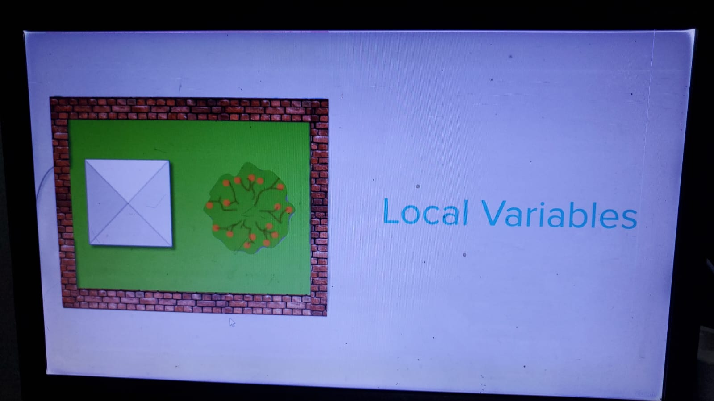
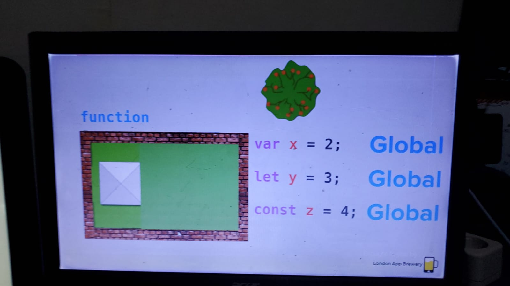

# UDEMY ANGELA WEB DEVELOPMENT

## section 21 : Git, Github and Version Control

---

---

### 254. introduction to version control and git

---

version control under git

you can roll back to the savepoint using git

using command line to use git version control

first you need to intialize git in the folder that you want with
`git init`

in order to start tracking the change of the file you need to add the file in to the staging area with `git status`

> staging area is an intermidiate place that you can pick can choose which files inside the working directory that you want to commit

if you check it right now it will be a list of untracked files, because nothing added to the staging area yet

in order to add to the staging area we can use `git add chapter1.txt`

`git commit -m "initial commit"` to commited to the version control

you can see what commit you have made by using `git log`

to add all of the file inside of the directory we use `git add .`

if you modify the file that have been tracked by git, if you check with `git status` you'll see modified file that hasn't been commited

to see the changes that you make you can use `git diff`

to change it into the previous version you can use `git checkout chapter3.txt`

> **this is how do you use git version control locally**

### 255. introduction to version control and git

---

how to set up git version control remotely

- go to git-hub >
- sign in >
- new repository >
- give repository name >
- give description >
- by default the github repository is public the private one is subscription >
- create repository >
- using a command line to push the existing repository that we got locally in to the remote repository in the website >
- back to the hyper terminal >
- creating a remote by using `git remote add origin https://github.com/pambayungiri/story.git` origin is the name that you can change it recommended is origin, url is the remote repository on github >
- `git push -u origin master` to push local repository to the remote repository using the -u (linked local and remote) to push it toward the name of the remote **origin** to the name of the branch **master** >
- if you go to the url you'll see the repository that you created
- and if you go to click insight > graph > network you can see the branch that you created

### 257. gitignore

---

**how to not push the secret code or something that you don't want to be include** in to the remote github repository

create hidden file for gitignore by using `touch .gitignore`

you can check the file by using `ls -a`

if you initialize git init and add `git add .` you will see your secret is being added in staging area so if you wanna undo it use `git rm --cached -r .` to remove all the file from staging area

you go to the `.gitignore` file and add the particular file that you don't want to add

now if you `git add .` the ==secret will not be commited==

> `*.txt` every .txt get ignore, `#comment` to comment in gitignore

### 258. git clone (cloning)

---

clone is copying file in to the local by using `git clone https://github.com/twbs/bootstrap.git` you get the url from the github

once you clone the project and cd into it you can see the commit by using `git log`

### 259. brancing and merging

---

make brancing to make a new feature and merging it in without effecting the main branch

you can create a new branch by using `git branch alienplot` the name of the branch can be anything

to checkout what branches you have you can use `git branch` without the name.

the asterix \* in the branch show that you currently work in that branch

if you want to choose another branch by using `git checkout alienplot`

how to merge the newly branch into the main **master** branch. **first** you can choose the main branch by using `git checkout master` and then merge the changes by using `git merge alienplot`

to see it merge use`git log` if you can't exit from git log `type q`

> pulled request in the website is to pull back the experimental to the master. you can compare it as well

==<https://learngitbranching.js.org/>== **learn github more**

### 260. forking and pull request

---

**forking** is copy of the **stranger remote repository** in your **remote repository**.

if you **fork** **somebody remote repository** it will be in your **remote repository** that you can **clone** it to make changes of it or to use it. if the changes is good you can **push** it again to your **remote repository** and make a **pull request** to the **original remote repository** and if the person who make repository prove it the person can **merge** it into the **original remote repository**.


> **i still confuse about git fetch and git pull??????**

## section 22 : EJS

---

---

### 265. templates? why do we need templates?

---

how to create a date in java script

```js
var today = new Date();
if (today.getDay() === 6 || today.getDay() === 0) {
  res.send("yeay it's the weekend!");
} else {
  res.send("boo i have to work");
}
```

`res.send` can only used once
`res.write` can use multiple time ==but you need to include res.send in the end to send the message==

```js
var today = new Date();
if (today.getDay() === 6 || today.getDay() === 0) {
  res.write("<h1>yeay it's the weekend!</h1>");
} else {
  res.write("<p>shit this is not weekend</p>");
  res.write("<h1>boo i have to work</h1>");
  res.send();
}
```

if you want to create multiple line of response you can use

```js
var today = new Date();
if (today.getDay() === 6 || today.getDay() === 0) {
  res.write("<h1>yeay it's the weekend!</h1>");
} else {
  res.sendFile(__dirname + "/index.html");
}
```

but you'll need several **html** to have several different answer **that's why we need templating**

### 266. Creating Your First EJS Templates

---

ejs is **embedded javascript templating**, it's one of the module that people use to make js template

`npm install ejs`
create `mkdir views` directory
create `list.ejs` in the views directory
anything that valid on `.html` will be valid in `.ejs`

```js
app.set("view engine", "ejs");
```

it tell express / app to use view engine **ejs**

to send value from app.js into the list.ejs we can use `<%= kindOfCode %>` and
then reference it into the app.js via `res.render("list", { kindOfCode: day });`

this is the **list.ejs** file

```html
<!DOCTYPE html>
<html lang="en">
  <head>
    <meta charset="UTF-8" />
    <meta http-equiv="X-UA-Compatible" content="IE=edge" />
    <meta name="viewport" content="width=device-width, initial-scale=1.0" />
    <title>To Do List</title>
  </head>
  <body>
    <h1>it's a <%= kindOfCode %>!</h1>
    <p>why are you not working</p>
  </body>
</html>
```

this is the **app.js** file

```js
const express = require("express");
const app = express();
const bodyParser = require("body-parser");
const port = 3000;

app.set("view engine", "ejs");

app.use(bodyParser.urlencoded({ extended: true }));

app.get("/", function (req, res) {
  var today = new Date();
  var day = "";

  if (today.getDay() === 6 || today.getDay() === 0) {
    day = "weekend";
  } else {
    day = "weekday";
  }

  res.render("list", { kindOfCode: day });
});

app.listen(port, () => {
  console.log(`Example app listening on port ${port}`);
});
```

> so basically it's telling you after you get **"/"** from a client your response **res** is to **render** the **list**.ejs and to put value **day** into the variable **kindOfCode** that you make inside the list.ejs html.

==they usually use the same variable for app.js and the list.ejs like `res.render("list", { day: day });`==

### 267. running code inside the ejs template

---

for running control flow in .ejs we can use `<% control-flow %>`
control flow :

- if else
- while
- for
- switch

`<%` it's what you called scriptlet

this is the **list.ejs**

```html
<!DOCTYPE html>
<html lang="en">
  <head>
    <meta charset="UTF-8" />
    <meta http-equiv="X-UA-Compatible" content="IE=edge" />
    <meta name="viewport" content="width=device-width, initial-scale=1.0" />
    <title>To Do List</title>
  </head>
  <body>
    <% if (kindOfCode === "saturday" || kindOfCode === "sunday") { %>
    <h1 style="color: purple">it's a <%= kindOfCode %>!</h1>
    <% } else { %>
    <h1 style="color: blue">it's a <%= kindOfCode %>!</h1>
    <% } %>

    <p>why are you not working</p>
  </body>
</html>
```

### 268. passing data from your webpage to your server

---

if you search **javascript date format** you'll come across **toLocaleDateString();** that allow you to format date with javascript

```js
new Date().toLocaleDateString('en-us', { weekday:"long", year:"numeric", month:"short", day:"numeric"}) 
```

- weekday – This outputs the day of the week depending on how you want it to appear (short or long).
- year – This outputs the year as a number
- month – This outputs the month of the year depending on how you want it to appear (short or long).
- day – Finally, this outputs the day as a number
- and en-us - is the region.

app will crash if you not putting this `<%= text %>` in the get that you want. because the get will render nothing. **make sure to add every `<%= text %>` that you have in every get that you have**

this is inside **list.ejs**

```html
<!DOCTYPE html>
<html lang="en">
  <head>
    <meta charset="UTF-8" />
    <meta http-equiv="X-UA-Compatible" content="IE=edge" />
    <meta name="viewport" content="width=device-width, initial-scale=1.0" />
    <title>To Do List</title>
  </head>
  <body>
    <h1><%= kindOfDay %></h1>

    <ul>
      <% for (let i = 0; i < newItemServer.length; i++) { %>
      <li><%= newItemServer[i] %></li>
      <% } %>
    </ul>

    <form action="/" method="post">
      <input type="text" name="newItem" placeholder="insert the list" />
      <button type="submit" name="button">add</button>
    </form>
  </body>
</html>
```

this is inside **app.js**

```js
const express = require("express");
const app = express();
const bodyParser = require("body-parser");
const port = 3000;

var items = ["buy food", "cook food", "eat food"];

app.set("view engine", "ejs");

app.use(bodyParser.urlencoded({ extended: true }));

app.get("/", function (req, res) {
  var today = new Date();

  var options = {
    weekday: "long",
    day: "numeric",
    month: "long",
    year: "numeric",
  };

  var day = today.toLocaleDateString("id-ID", options);

  res.render("list", { kindOfDay: day, newItemServer: items });
});

app.post("/", function (req, res) {
  var item = req.body.newItem;
  items.push(item);
  res.redirect("/");
});

app.listen(port, () => {
  console.log(`Example app listening on port ${port}`);
});
```

and the result was


### 269. the concept of scope in the context of javascript

---





`const` can't be change at all

`var and let` can be change but they behave differently





try and avoid using keyword `var` very very few scenario you'll use var. if you want to use var use let instead

### 270. adding pre-made css stylesheets to your website

---

use folder public for static resource, make a folder called public.
to call public in app.js you can use `app.use(express.static("public"))`

imagine app.js is inside the public
`<link rel="stylesheet" href="css/styles.css" />`

==this is list.ejs==

```html
<%- include('header'); -%>
    <div class="box" id="heading">
      <h1><%= listTitle %></h1>
    </div>
    <div class="box">
      <% for (let i = 0; i < newListItems.length; i++) { %>
      <div class="item">
        <input type="checkbox" />
        <p><%= newListItems[i] %></p>
      </div>
      <% } %>
      <form action="/" method="post" class="item">
        <input
          type="text"
          name="newItem"
          placeholder="New Item"
          autocomplete="off"
        />
        <button type="submit" name="list" value=<%= listTitle %>>+</button>
      </form>
    </div>
    <%- include('footer'); -%>
```

==this is header.ejs==

```html
<!DOCTYPE html>
<html lang="en">
  <head>
    <meta charset="UTF-8" />
    <meta http-equiv="X-UA-Compatible" content="IE=edge" />
    <meta name="viewport" content="width=device-width, initial-scale=1.0" />
    <title>To Do List</title>
    <link rel="stylesheet" href="css/styles.css" />
  </head>
  <body>
  ```

  ==this is footer.ejs==

  ```html
  </body>
<footer>Copyright marshpotao 2022</footer>
</html>
```

==this is about.ejs==

```html
<%- include('header'); -%>
<h2>about page</h2>
<%- include('footer'); -%>
```

==this is app.js==

```js
const express = require("express");
const app = express();
const bodyParser = require("body-parser");
const port = 3000;


let items = ["buy food", "cook food", "eat food"];
let workItems = [];
app.set("view engine", "ejs");

app.use(bodyParser.urlencoded({ extended: true }));
app.use(express.static("public"));

app.get("/", function (req, res) {
    let today = new Date();

    let options = {
      weekday: "long",
      day: "numeric",
      month: "long",
      year: "numeric",
    };
  
    let day = today.toLocaleDateString("id-ID", options);
  res.render("list", { listTitle: day, newListItems: items });
});

app.post("/", function (req, res) {
  let item = req.body.newItem;
  console.log(req.body.list);
  if (req.body.list === "Work") {
    workItems.push(item);
    res.redirect("/work");
  } else {
    items.push(item);
    res.redirect("/");
  }
});

app.get("/work", function (req, res) {
  res.render("list", { listTitle: "Work List", newListItems: workItems });
});

app.get("/about", function (req, res) {
  res.render("about");
});

app.listen(port, () => {
  console.log(`Example app listening on port ${port}`);
});
```

### 272. Understanding node module export: how to pass function and data between files

---

if you create date.js and export function with () it will automatically executed eventhough you grab it inside the variable in the next app.js file that's why you don't use () `module.exports = getDate;` and when you want to call it inside the variable like this `const date = require(__dirname + "/date.js");` simply just `console.log(date());` it will return the date `Sabtu, 3 Desember 2022` but if you `console.log(date);` it will return `[Function: getDate]`.

this is how to setup pass code into other `.js` file (the longer version)

```js
module.exports.getDate = getDate;

function getDate() {
    let today = new Date();

    let options = {
      weekday: "long",
      day: "numeric",
      month: "long",
      year: "numeric",
    };
  
    let day = today.toLocaleDateString("id-ID", options);
    return day;
}

module.exports.getDay = getDay;

function getDay() {
    let today = new Date();

    let options = {
      weekday: "long",
    };
  
    let day = today.toLocaleDateString("id-ID", options);
    return day;
}
```

this is the (shortest version)

```js
exports.getDate = function () {
  let today = new Date();

  let options = {
    weekday: "long",
    day: "numeric",
    month: "long",
    year: "numeric",
  };

  let day = today.toLocaleDateString("id-ID", options);
  return day;
};

exports.getDay = function () {
  let today = new Date();

  let options = {
    weekday: "long",
  };

  let day = today.toLocaleDateString("id-ID", options);
  return day;
};
```

this is how you call it

```js
const date = require(__dirname + "/date.js");
let day = date.getDate();
let day = date.getDay();
```

this is overall app.js

```js
const express = require("express");
const app = express();
const bodyParser = require("body-parser");
const date = require(__dirname + "/date.js");
const port = 3000;

const items = ["buy food", "cook food", "eat food"];
const workItems = [];
app.set("view engine", "ejs");

app.use(bodyParser.urlencoded({ extended: true }));
app.use(express.static("public"));

app.get("/", function (req, res) {
  const day = date.getDate();
  res.render("list", { listTitle: day, newListItems: items });
});

app.post("/", function (req, res) {
  const item = req.body.newItem;
  console.log(req.body.list);
  if (req.body.list === "Work") {
    workItems.push(item);
    res.redirect("/work");
  } else {
    items.push(item);
    res.redirect("/");
  }
});

app.get("/work", function (req, res) {
  res.render("list", { listTitle: "Work List", newListItems: workItems });
});

app.get("/about", function (req, res) {
  res.render("about");
});

app.listen(port, () => {
  console.log(`Example app listening on port ${port}`);
});

```

`const`

```js
const object = {"key": "value"}
object = {"other_key": "value"} == ERROR ==
object.key = "other value" == EXECUTED ==

const array = []
array.push("a") == EXECUTED ==
array = ["a"] == ERROR ==
```

## 23. Boss level challenge 3 - blog website

---

---

how to install the node module from the git clone that has no nodemodule init by using `npm install`

>it will install all dependencies and node module in the directory

---

`console.log(Object.values(posts[i])[0])`

```js
const array1 = ['a', 'b', 'c'];

array1.forEach(element => console.log(element));

// expected output: "a"
// expected output: "b"
// expected output: "c"
```

---

==katacoda.com for node playground==

---

express route parameter

nodemon restart is typing `rs` in terminal

<http://localhost:3000/posts/hey>

```js
app.get("/posts/:topic", function (req, res) {
  console.log(req.params.topic);
});
```

will console.log `hey`

---

node developer usually use **lodash**
<https://lodash.com/>

install using npm
`$ npm i -g npm`
`$ npm i --save lodash`

using it with node js

`var _ = require('lodash');`

using the lowerCase function

```js
_.lowerCase('--Foo-Bar--');
// => 'foo bar'
 
_.lowerCase('fooBar');
// => 'foo bar'
 
_.lowerCase('__FOO_BAR__');
// => 'foo bar'
```

how to search in google

>**verb** > **object** > **programming language**
truncate > string > javascript

## section 24 : Database

---

---

### 319. Databases Explained: SQL vs. NOSQL

---

choosing the databases that you want

the main different

- sql
  strutured query language
  relational
  - ORM (object relational mapper)
  - if you find excel and googlesheet is alright
  - sequel database will group your data into tables
  - structured and reliable
  - good at relationships
  - choose sql if the data have many relationship
  - the more data you have the more slow you get in 1 comp > because is table (scalability)
- nosql
  not only structured query language
  non relational
  - ODM (object document mapper)
  - if you working with mongodb the data will be represented with json
  - the data doesn't have to be the same shape or structured
  - flexible
  - not good at relationships
  - choose mongodb if the the single data have so many content
  - the more data you have can be distributed among all the comp > because it's document (scalability)


## section 25 : SQL

---

---

### 320. SQL Commands: create table and insert data

---

great resource w3schools.com

we can create manipulated destroy etc in sql

but in every single type of database the **main thing that you be doing with it is CRUD** :

- ==create==
- read
- update
- destroy

sqliteonine.com is a playground allow you to try using sql language

PRIMARY KEY is the key to call the one of the value of the table

==to make a table schema==

```SQL
CREATE TABLE products (
  id INT NOT NULL,
  name STRING,
  price MONEY,
  PRIMARY key (id)
  )
  ```

sql insert into statement ==to add or insert the value in the table==

```sql
INSERT INTO products 
VALUES (1, "pen", 1.20)
```

  if you want to fill specific value in specific column or
  you want to skip the collumn. in the code below it will only fill the id and name the price will be NULL

```sql
INSERT INTO products (id, name)
VALUES (2, "Pencil")
```

it will be error if the id is NULL

```sql
INSERT INTO products (name, price)
VALUES ("rubber", 1.30)
```

### 321. SQL Commands: READ, SELECT, and WHERE

---

==read==

how do you read or show the tables we use `SELECT * FROM 'products';`
`product`  is the the tables that i wanna see
`*` wild card is means all in the tables

if you just wanted to see 1 or 2 columns you can use
`SELECT name, price FROM 'products';` we just see columns name and price

if you just wnated to see a particular row you can use
`SELECT * FROM products WHERE id = 1` we just see all the columns in id 1

### 322. updatting single values and adding columns in sql

---

==update==

how to update a single value
`UPDATE products SET price = 0.8 WHERE id=2` update the values of the product column price row id=2

how to update by adding a new columns
`ALTER TABLE products ADD stock INT` create a table columns that have name of stock and the input value is INT

### 323. SQL commands, delete

---

==destroy==

`DELETE FROM products WHERE id = 2` if we want to delete row 2

### 323. understanding sql relationships, foreign keys, inner joins

---

we can inner joins or combine 2 tables to 1 table that have the columns that we want

product schema

```sql
CREATE TABLE products (
  id INT NOT NULL,
  name STRING,
  price MONEY, stock INT,
  PRIMARY KEY (id)
  )
```


customers schema

```sql
CREATE TABLE customers (
  id INT not NULL,
  first_name STRING,
  last_name STRING,
  address STRING,
  PRIMARY KEY (id)
  )
```


orders schema

```sql
CREATE TABLE orders (
  id INT not NULL,
  order_number INT,
  costumer_id INT,
  products_id INT,
  PRIMARY KEY (id),
  FOREIGN KEY (costumer_id) REFERENCES customers(id)
  FOREIGN KEY (products_id) REFERENCES products(id)
  )
```


we can inner joins the table from table order and costumer

```sql
SELECT orders.order_number, customers.last_name, costumer.last_name, customers.address
FROM orders
INNER JOIN customers on orders.costumer_id = customers.id
```


we can inner joins the table from table order and product

```sql
SELECT orders.order_number, products.name, products.price, products.stock
FROM orders
INNER JOIN products on orders.products_id = products.id
```


## section 26 : MongoDB

---

---

### 327. Installing MongoDB on Windows

---

MongoDB Data directory `C:\Program Files\MongoDB\Server\6.0\data\`
MongoDB Log directory `C:\Program Files\MongoDB\Server\6.0\log\`

follow all the instruction in the video

installing **mongosh**
C:\Users\pamba\AppData\Local\Programs\mongosh\

in the  `~` create `touch .bash_profile` to setup the shortcut and then type this

>alias mongod="/c/Program\ files/MongoDB/Server/6.0/bin/mongod.exe"
>alias mongosh="/c/Users/pamba/AppData/Local/Programs/mongosh/mongosh.exe"

### 328. MongoDB CRUD operations in the shell: Create

---

`mongod` will spin up the server

new terminal / new tab and type `mongosh` the type change to > it's ready to use `mongosh / mongo shell` it's just a way to interact with mongodb databases on the local system using **command line**

`help` to see what kind of thing you can do inside mongo shell
`show dbs` to show database names
`use shopDB` create the shopDB databases

but it we use `show dbs` it will not show because it has to contain some data

`db` it tells you where database you currently at

mongodb crud operation

create operations
`db.collection.insertOne()`
`dib.collection.insertMany()`

collection is the name of the collection if it doesn't exist it will created it for you

==create== **products** collection inside **shopDB** database
`db.products.insertOne({_id: 1, name: "Pen", price:1.20})`
`db.products.insertOne({_id: 2, name: "Pencil", price:1.20})`

>**collection** in **mongoDB** it's kind off similar to **tables** in **SQL**
**collection** ( **collection** of a **document** ) **document** is a single data record or **row** in **SQL**

`show collections` it will all the **collection** inside the current **database** **shopDB**

### 329. MongoDB CRUD operations in the shell: Reading & queries

---

how to ==read== operations
`db.collection.find(query,projection)`

if you type this you get
`db.products.find()`

```json
[
  { _id: 1, name: 'Pen', price: 1.2 },
  { _id: 2, name: 'Pencil', price: 1.2 }
]
```

if you type this you get
`db.products.find({name: "Pencil"})`

```json
[ { _id: 2, name: 'Pencil', price: 1.2 } ]
```

if you type this you get
`db.products.find({price: {$gt: 1}})`

`{$gt: 1}` it's **query selector** it means in the document when the price greater than 1

```json
[
  { _id: 1, name: 'Pen', price: 1.2 },
  { _id: 2, name: 'Pencil', price: 1.2 }
]
```

the pencil should be 0.8 my mistake of typo

if you type this you get
`db.products.find({_id:1}, {name:1})`

`{name:1}` this is **projection** it means what kind off return do you want to display in this case ( show the name:1 ) and 1 means true 0 means false

```json
[ { _id: 1, name: 'Pen' } ]
```

whenever you use `find` id always come with default but you can disable it by using projection

`db.products.find({_id:1}, {name:1, _id: 0})`

```json
[ { name: 'Pen' } ]
```

### 330. MongoDB CRUD operations in the shell: update

---

==update== operation
if you type this you get
`db.products.updateOne({_id: 1}, {$set: {stock: 32}})`

the `$set` will set the new **field** stock that has a **value** of 32

```json
[
  { _id: 1, name: 'Pen', price: 1.2, stock: 32 },
  { _id: 2, name: 'Pencil', price: 1.2 }
]
```

### 331. MongoDB CRUD operations in the shell: delete

---

==delete== operation
`db.collection.deleteOne()`
`db.collection.deleteMany()`

if you type this you get
`db.products.deleteOne({_id:2})`

the id 2 will be deleted

```json
[ { _id: 1, name: 'Pen', price: 1.2, stock: 32 } ]
```

>how to ==delete== the database **shopDB** first switched to the shopDB using `use shopDB` and then `db.dropDatabase()`
>how to ==delete the colleciton inside the database== first switched to the database and then `db.nameofthecollection.drop()`

### 332. relationship in mongoDB

---

the first way (the preffered way)

every document is represented by the curly bracket
embeded document inside the document can be establish

```json
db.products.insert(
    {
        _id: 3,
        name: "Rubber",
        price: 1.30,
        stock: 43,
        reviews: [
            {
                authorName: "Sally",
                rating: 5,
                review: "Best rubber ever!"
            },
            {
                authorName: "John",
                rating: 5,
                review: "Awesome rubber ever!"
            }
        ]
    }
)
```

you will get

```json
[
  { _id: 1, name: 'Pen', price: 1.2, stock: 32 },
  {
    _id: 3,
    name: 'Rubber',
    price: 1.3,
    stock: 43,
    reviews: [
      { authorName: 'Sally', rating: 5, review: 'Best rubber ever!' },
      { authorName: 'John', rating: 5, review: 'Awesome rubber ever!' }
    ]
  }
]
```

### 333. working with the native mongoDB driver

---

mongoDB interact with our app with the driver in this case we use node.js

`npm init -y` the accept all the default

`npm install mongodb`

everything that `assert` it's always to do with testing

==just use mongoose==

## section 27 : Mongoose

---

---

### 336. introduction to mongoose

---
how do you ==create==

install mongoose `npm install mongoose`

```js
const mongoose = require("mongoose");

mongoose.connect("mongodb://127.0.0.1:27017/fruitsDB");

const fruitSchema = new mongoose.Schema({
  name: String,
  rating: Number,
  review: String,
});

const Fruit = mongoose.model("Fruit", fruitSchema);

const fruitDocument = new Fruit({
  name: "Apple",
  rating: 7,
  review: "Pretty solid as a fruit.",
});

fruitDocument.save();
```

the result would be the **database** of fruitsDB with the **collection** of ==fruits== (mongoose will automatically lowercase and make it plural from **"Fruit"**) and have the value of name rating review

```js
const mongoose = require("mongoose");

mongoose.connect("mongodb://127.0.0.1:27017/fruitsDB");

const personSchema = new mongoose.Schema({
  name: String,
  age: Number,
});

const Person = mongoose.model("Person", personSchema);

const person = new Person({
  name: "John",
  age: 37,
});

person.save();
```

it will create a collection called **people**(it convert "Person" singular form to plural form which is people) inside the database fruitsDB

this is how to **add many values in the collection**

```js
const mongoose = require("mongoose");

mongoose.connect("mongodb://127.0.0.1:27017/fruitsDB");

const fruitSchema = new mongoose.Schema({
  name: String,
  rating: Number,
  review: String,
});

const Fruit = mongoose.model("Fruit", fruitSchema);

const kiwi = new Fruit({
  name: "Kiwi",
  rating: 10,
  review: "the best fruit!",
});
const orange = new Fruit({
  name: "Orange",
  rating: 4,
  review: "too sour for me",
});
const banana = new Fruit({
  name: "Banana",
  rating: 3,
  review: "wierd texture",
});

Fruit.insertMany([kiwi, orange, banana], function (err) {
  if (err) {
    console.log(err);
  } else {
    console.log("succesfully saved all the fruits to fruitsDB");
  }
});

// const fruitDocument = new Fruit({
//     name: "Apple",
//     rating: 7,
//     review: "Pretty solid as a fruit.",
//   });

//fruitDocument.save();
```

this is the result

```json
  {
    _id: ObjectId("638dc3b0bb57848eaaecc9c1"),
    name: 'Kiwi',
    rating: 10,
    review: 'the best fruit!',
    __v: 0
  },
  {
    _id: ObjectId("638dc3b0bb57848eaaecc9c2"),
    name: 'Orange',
    rating: 4,
    review: 'too sour for me',
    __v: 0
  },
  {
    _id: ObjectId("638dc3b0bb57848eaaecc9c3"),
    name: 'Banana',
    rating: 3,
    review: 'wierd texture',
    __v: 0
  }
```

### 337. reading from your database with mongoose

---
how to ==read==
use `Fruit.find()`

```js
const mongoose = require("mongoose");

mongoose.connect("mongodb://127.0.0.1:27017/fruitsDB");

const fruitSchema = new mongoose.Schema({
  name: String,
  rating: Number,
  review: String,
});

const Fruit = mongoose.model("Fruit", fruitSchema);

const kiwi = new Fruit({
  name: "Kiwi",
  rating: 10,
  review: "the best fruit!",
});
const orange = new Fruit({
  name: "Orange",
  rating: 4,
  review: "too sour for me",
});
const banana = new Fruit({
  name: "Banana",
  rating: 3,
  review: "wierd texture",
});

// Fruit.insertMany([kiwi, orange, banana], function (err) {
//   if (err) {
//     console.log(err);
//   } else {
//     console.log("succesfully saved all the fruits to fruitsDB");
//   }
// });

const fruit = new Fruit({
  name: "Apple",
  rating: 7,
  review: "Pretty solid as a fruit.",
});

// fruit.save();

const personSchema = new mongoose.Schema({
  name: String,
  age: Number,
});

const Person = mongoose.model("Person", personSchema);

const person = new Person({
  name: "John",
  age: 37,
});

// person.save();

Fruit.find({}, function (err, fruits) {
  if (err) {
    console.log(err);
  } else {
    mongoose.connection.close();
    fruits.forEach((fruit) => {
      console.log(fruit.name);
    });
  }
});

// Person.find(function (err, person) {
//   if (err) {
//     console.log(err);
//   } else {
//     mongoose.connection.close();
//     person.forEach((person) => {
//       console.log(person.name);
//     });
//   }
// });
```

it will return **array of model that we create and choose to look at**. in this case it will return (apple,kiwi,orange,banana) because it look at the fruit array and specify the name of it

### 338. data validation with mongoose

---

inside the schema that we type we can specify how do we agree or disagree with the value using what you called **validator** / **data validaition** inside the mongoose reference

```js
const mongoose = require("mongoose");

mongoose.connect("mongodb://127.0.0.1:27017/fruitsDB");

const fruitSchema = new mongoose.Schema({
  name: {
    type: String,
    required: [true, "there's no name in it"],
  },
  rating: {
    type: Number,
    min: 1,
    ma: 10,
  },
  review: String,
});

const Fruit = mongoose.model("Fruit", fruitSchema);

const fruit = new Fruit({
  name: "Apple",
  rating: 7,
  review: "Pretty solid as a fruit.",
});

fruit.save();
```

### 339. updating and deleting data using mongoose

---

>database > collection > document / record

how to ==update== data

```js
const mongoose = require("mongoose");

mongoose.connect("mongodb://127.0.0.1:27017/fruitsDB");

const fruitSchema = new mongoose.Schema({
  name: {
    type: String,
    required: [true, "there's no name in it"],
  },
  rating: {
    type: Number,
    min: 1,
    ma: 10,
  },
  review: String,
});

const Fruit = mongoose.model("Fruit", fruitSchema);

const apple = new Fruit({
  name: "Apple",
  rating: 10,
  review: "peaches are so yummy!",
});

// apple.save();

Fruit.updateOne(
  { _id: "638dd67b363b35df0f0f8977" },
  { name: "Peach" },
  function (err) {
    if (err) {
      console.log(err);
    } else {
      console.log("succesfully updated the document.");
    }
  }
);
```

it will update the peach name in the back of the entry but the order doesn't matter. cuz we can always refer it from `.`

how to ==delete== data

```js
const mongoose = require("mongoose");

mongoose.connect("mongodb://127.0.0.1:27017/fruitsDB");

const fruitSchema = new mongoose.Schema({
  name: {
    type: String,
    required: [true, "there's no name in it"],
  },
  rating: {
    type: Number,
    min: 1,
    ma: 10,
  },
  review: String,
});

const Fruit = mongoose.model("Fruit", fruitSchema);

const apple = new Fruit({
  name: "Apple",
  rating: 10,
  review: "peaches are so yummy!",
});

// apple.save();

Fruit.deleteOne(
  { name: "Peach" },
  function (err) {
    if (err) {
      console.log(err);
    } else {
      console.log("succesfully deleted the document.");
    }
  }
);
```

the parameter can be something unique like name or id

this is how to **deleteMany**

```js
Person.deleteMany({name: "John"}, function (err) {
    if (err){
        console.log(err);
    } else {
        console.log("succesfully deleted all the document");
    }
    
})
```

this is how you can **delete the** **collection**

```js
const fruitcollections = mongoose.model("fruitcollection", fruitSchema);
fruitcollections.collection.drop();
```

### 340. establishing relationships and embedding documents using mongoose

---

```js
const mongoose = require("mongoose");

mongoose.connect("mongodb://127.0.0.1:27017/fruitsDB");

const fruitSchema = new mongoose.Schema({
  name: {
    type: String,
    required: [true, "there's no name in it"],
  },
  rating: {
    type: Number,
    min: 1,
    ma: 10,
  },
  review: String,
});

const Fruit = mongoose.model("Fruit", fruitSchema);

const pineapple = new Fruit({
  name: "Pineapple",
  rating: 10,
  review: "peaches are so yummy!",
});

pineapple.save();

const personSchema = new mongoose.Schema({
  name: String,
  age: Number,
  favouriteFruit: fruitSchema,
});

const Person = mongoose.model("Person", personSchema);

const person = new Person({
  name: "Amy",
  age: 12,
  favouriteFruit: pineapple
});

person.save();
```

it will embedded the **pineapple** with **fruitschema** to **amy** and the result was this

```json
fruitsDB> db.people.find()
[
  {
    _id: ObjectId("638dc09a9eb452897c6372d1"),
    name: 'John',
    age: 37,
    __v: 0
  },
  {
    _id: ObjectId("638df18ac6eb2def49000f54"),
    name: 'Amy',
    age: 12,
    favouriteFruit: {
      name: 'Pineapple',
      rating: 10,
      review: 'peaches are so yummy!',
      _id: ObjectId("638df18ac6eb2def49000f53")
    },
    __v: 0
  }
]
```

you can **update the data and embedded the relationship** to the existing data

```js
const mongoose = require("mongoose");

mongoose.connect("mongodb://127.0.0.1:27017/fruitsDB");

const fruitSchema = new mongoose.Schema({
  name: {
    type: String,
    required: [true, "there's no name in it"],
  },
  rating: {
    type: Number,
    min: 1,
    ma: 10,
  },
  review: String,
});

const Fruit = mongoose.model("Fruit", fruitSchema);

const watermelon = new Fruit({
  name: "Watermelon",
  rating: 10,
  review: "peaches are so yummy!",
});

watermelon.save();

const personSchema = new mongoose.Schema({
  name: String,
  age: Number,
  favouriteFruit: fruitSchema,
});

const Person = mongoose.model("Person", personSchema);

Person.updateOne(
  { name: "John" },
  { favouriteFruit: watermelon },
  function (err) {
    if (err) {
      console.log(err);
    } else {
      console.log("succesfully updated the document.");
    }
  }
);
```

the result was this

```json
fruitsDB> db.people.find()
[
  {
    _id: ObjectId("638dc09a9eb452897c6372d1"),
    name: 'John',
    age: 37,
    __v: 0,
    favouriteFruit: {
      name: 'Watermelon',
      rating: 10,
      review: 'peaches are so yummy!',
      _id: ObjectId("638df3d3c8e213d0d49c01a6")
    }
  },
  {
    _id: ObjectId("638df18ac6eb2def49000f54"),
    name: 'Amy',
    age: 12,
    favouriteFruit: {
      name: 'Pineapple',
      rating: 10,
      review: 'peaches are so yummy!',
      _id: ObjectId("638df18ac6eb2def49000f53")
    },
    __v: 0
  }
]
```
