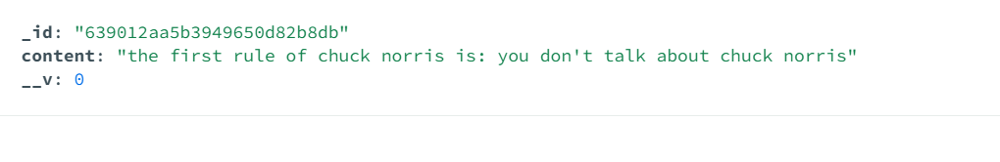

# UDEMY ANGELA WEB DEVELOPMENT

## section 28: putting everything together

---

---

how to submit form when **checkbox** is checked

```html
      <% newListItems.forEach(function (item){ %>
      <form action="/delete" method="post">
        <div class="item">
          <input type="checkbox" name="checkbox" onChange="this.form.submit()"/>
          <p><%= item.name %></p>
        </div>
      </form>
      <% }) %>
```

in javascript

```js
app.post("/delete", function (req, res) {
  console.log(req.body);
  
})
```

the result would be

```json
{ checkbox: 'on' }
```

in javascript

```js
app.post("/delete", function (req, res) {
  console.log(req.body.checkbox);
  
})
```

the result would be

```json
on
```

in html there is input **value** on it

```html
      <% newListItems.forEach(function (item){ %>
      <form action="/delete" method="post">
        <div class="item">
          <input type="checkbox" name="checkbox" value="<%=item._id%>" onChange="this.form.submit()"/>
          <p><%= item.name %></p>
        </div>
      </form>
      <% }) %>
```

in javascript

```js
app.post("/delete", function (req, res) {
  console.log(req.body.checkbox);
  
})
```

the result would be

```json
638ecc8402eb16fa150f1107
```

in javascript

```js
app.post("/delete", function (req, res) {
  console.log(req.body);
  
})
```

the result would be

```json
{ checkbox: '638ecc8402eb16fa150f1107' }
```

express route parameter

```js
app.get("/:postName", function (req, res) {
  const requestedTitle = req.params.postName;
  res.render("list", { listTitle: requestedTitle, newListItems: workItems });
});
```

---

`list.find({}, callback)` it return **array**
`list.findOne({}, callback)` it return **object**

---

this is how to redirect to the `/:postName`

```js
app.get("/:customListName", function (req, res) {
const customListName = req.params.customListName;
        res.redirect("/" + customListName);
})
```

---

mongoose remove document from array

in mongodb
the $pull operatorremoves form an eisting array all instances of a value or values that match a specified condition.

in mongoose
model.findOneAndUpdate({conditions},{updtades},function(err, results){})
model.findOneAndUpdate({conditions},{$pull: {_id: {value}}},function(err, results){})

---

>in railways you don't have to upload the node module to host the web.

## section 31: Build Your own RESTful api from scratch

---

---

### 362. what is REST?

---

what is REST

- **RE**presentational
- **S**tate
- **T**ransfer

**http** request ( **hyper text transfer protocol** ) request

app.get(function(req, res))

**ftp** request ( **file transfer protocol** ) request

**https** request ( **hyper text transfer protocol secure** ) request

all your req and res is going to the internet. so you want to be secure and using encrypting request.

to give the result the **server** might **calculate** or communicate with **database**

the server have a bunch of API that the server can response to for the client

the gold standard for **API** is **REST** structured

a lot of rule for API to be RESTful

1. use HTTP request verbs
2. use specific pattern of routes/endpoint URLs

`what are the http verbs?`

- get
- post
- put and patch
- delete

==get== for crud is read (app.get)

==post== for crud is create (app.post)

==put and patch== for crud is update

- **put** is **updating** the database by putting the entire entry and **replacing the previous one**
- **patch** is **updating** the database by sending a piece of data that need to be updated **without replacing all the entry**

==delete== for crud is delete (app.delete)

`use specific pattern of routes/endpoint URLs`


### 363. creating the database with robo 3t

---

to create the **collection** don't forget to use **lowercase and plural** for naming it

they use robo 3t

i use compass

### 364. and 365. setup server challange

---

server boilerplate

- create new directory called Wiki-API
- initialise NPM and install body-parser, mongoose, ejs and express
- create a new file called app.js
- inside app.js add server code (write/copy)
- setup mongoDB:
  - DB name is wikiDB
  - colection name is articles
  - document has 2 fields: title and content

```js
const express = require("express");
const app = express();
const bodyParser = require("body-parser");
const mongoose = require("mongoose");
const port = process.env.PORT || 3000;

app.set("view engine", "ejs");
app.use(bodyParser.urlencoded({ extended: true }));
app.use(express.static("public"));

mongoose.set("strictQuery", true);

mongoose.connect("mongodb://127.0.0.1:27017/wikiDB", {
  useNewUrlParser: true,
});

const articleSchema = new mongoose.Schema({
  title: {
    type: String,
    required: [true, "there's no title in it"],
  },
  content: String,
});

const Article = mongoose.model("Article", articleSchema);

Article.find({}, function (err, article) {
  if (err) {
    console.log(err);
  } else {
    console.log(article);
  }
});


app.listen(port, () => {
  console.log(`Example app listening on port ${port}`);
});
```

>==app.use(express.static("public"));== this thing used to store static file such as images and css files in **public directory**

### 366. GET all articles

---

==GET==


firstly we use **https** verbs **GET** to **fetches all the articles** using **/articles**

```js
const express = require("express");
const app = express();
const bodyParser = require("body-parser");
const mongoose = require("mongoose");
const port = process.env.PORT || 3000;

app.set("view engine", "ejs");
app.use(bodyParser.urlencoded({ extended: true }));
app.use(express.static("public"));

mongoose.set("strictQuery", true);
mongoose.connect("mongodb://127.0.0.1:27017/wikiDB", {
  useNewUrlParser: true,
});

const articleSchema = new mongoose.Schema({
  title: {
    type: String,
    required: [true, "there's no title in it"],
  },
  content: String,
});

const Article = mongoose.model("Article", articleSchema);

app.get("/articles", function (req, res) {
  Article.find({}, function (err, foundArticles) {
    if (err) {
      console.log(err);
    } else {
      res.send(foundArticles);
    }
  });
});

app.listen(port, () => {
  console.log(`Example app listening on port ${port}`);
});
```

the result is


### 367. POST a new article

---

==POST==

we don't have a web form to post from the client. we use the handy tools call **postman** that enable us to **send data and test our API without worrying about building html form** or building up the front end at all.

from **RESTful** api the **post** should go to the **collections of resources** rather than a specific resource. if you have a bunch of **/articles** you should go there rather than **/articles/jack-bauer**

```js
app.post("/articles", function (req, res) {
  console.log(req.body.title);
  console.log(req.body.content);
});
```

go to postman and then type local host and the /srticles that we define


and the result is in the console.log

```json
jack-bauer
asldflaksdjflkjsaldf
```

but if you do this the **postman expecting something back** and because you're not determine anything in there the **postman will hanging**

that's why we send something back

```js
app.post("/articles", function (req, res) {
    const newArticle = new Article({
        title: req.body.title,
        content: req.body.content  
    });
    newArticle.save(function(err){
        if (!err) {
            res.send("succesfully added a new article.");
        } else {
            res.send(err);
        }
    });
});
```

and the result was this


### 368. DELETE all articles

---

==delete==

```js
app.delete("/articles", function (req, res) {
    Article.deleteMany({}, function (err) {
        if (!err){
            res.send("succesfully deleted the articles");
        } else {
            res.send(err);
        }
    });
});
```

in the postman


it will delete all of the articles file in the database

### 369. Chained Route handlers using express

---

**app.route()** will packing together app.get() app.post() etc into one route if they have the same route

```js
const express = require("express");
const app = express();
const bodyParser = require("body-parser");
const mongoose = require("mongoose");
const port = process.env.PORT || 3000;

app.set("view engine", "ejs");
app.use(bodyParser.urlencoded({ extended: true }));
app.use(express.static("public"));

mongoose.set("strictQuery", true);
mongoose.connect("mongodb://127.0.0.1:27017/wikiDB", {
  useNewUrlParser: true,
});

const articleSchema = new mongoose.Schema({
  title: {
    type: String,
    required: [true, "there's no title in it"],
  },
  content: String,
});

const Article = mongoose.model("Article", articleSchema);

app.get("/articles", function (req, res) {
  Article.find({}, function (err, foundArticles) {
    if (err) {
      console.log(err);
    } else {
      res.send(foundArticles);
    }
  });
});

app.post("/articles", function (req, res) {
    const newArticle = new Article({
        title: req.body.title,
        content: req.body.content  
    });
    newArticle.save(function(err){
        if (!err) {
            res.send("succesfully added a new article.");
        } else {
            res.send(err);
        }
    });
});

app.delete("/articles", function (req, res) {
    Article.deleteMany({}, function (err) {
        if (!err){
            res.send("succesfully deleted the articles");
        } else {
            res.send(err);
        }
    });
});

app.listen(port, () => {
  console.log(`Example app listening on port ${port}`);
});
```

with using app.route() you can do this

```js
const express = require("express");
const app = express();
const bodyParser = require("body-parser");
const mongoose = require("mongoose");
const port = process.env.PORT || 3000;

app.set("view engine", "ejs");
app.use(bodyParser.urlencoded({ extended: true }));
app.use(express.static("public"));

mongoose.set("strictQuery", true);
mongoose.connect("mongodb://127.0.0.1:27017/wikiDB", {
  useNewUrlParser: true,
});

const articleSchema = new mongoose.Schema({
  title: {
    type: String,
    required: [true, "there's no title in it"],
  },
  content: String,
});

const Article = mongoose.model("Article", articleSchema);

app
  .route("/articles")
  .get(function (req, res) {
    Article.find({}, function (err, foundArticles) {
      if (err) {
        console.log(err);
      } else {
        res.send(foundArticles);
      }
    });
  })
  .post(function (req, res) {
    const newArticle = new Article({
      title: req.body.title,
      content: req.body.content,
    });
    newArticle.save(function (err) {
      if (!err) {
        res.send("succesfully added a new article.");
      } else {
        res.send(err);
      }
    });
  })
  .delete(function (req, res) {
    Article.deleteMany({}, function (err) {
      if (!err) {
        res.send("succesfully deleted the articles");
      } else {
        res.send(err);
      }
    });
  });

app.listen(port, () => {
  console.log(`Example app listening on port ${port}`);
});
```

### 370. Get a specific article

---

==GET specific==

reference **urlencode** the **space** in url is replaced by **%20**
<https://www.w3schools.com/tags/ref_urlencode.ASP>

for example
<http://localhost:3000/articles/jack%20bauer>

you'll get

```json
{
    "_id": "639012aa5b3949650d82b8db",
    "title": "jack bauer",
    "content": "jack bauer once stepped into quicksand. the quicksand almost drown",
    "__v": 0
}
```

this is the js

```js
const express = require("express");
const app = express();
const bodyParser = require("body-parser");
const mongoose = require("mongoose");
const port = process.env.PORT || 3000;

app.set("view engine", "ejs");
app.use(bodyParser.urlencoded({ extended: true }));
app.use(express.static("public"));

mongoose.set("strictQuery", true);
mongoose.connect("mongodb://127.0.0.1:27017/wikiDB", {
  useNewUrlParser: true,
});

const articleSchema = new mongoose.Schema({
  title: {
    type: String,
    required: [true, "there's no title in it"],
  },
  content: String,
});

const Article = mongoose.model("Article", articleSchema);

app
  .route("/articles")
  .get(function (req, res) {
    Article.find({}, function (err, foundArticles) {
      if (err) {
        console.log(err);
      } else {
        res.send(foundArticles);
      }
    });
  })
  .post(function (req, res) {
    const newArticle = new Article({
      title: req.body.title,
      content: req.body.content,
    });
    newArticle.save(function (err) {
      if (!err) {
        res.send("succesfully added a new article.");
      } else {
        res.send(err);
      }
    });
  })
  .delete(function (req, res) {
    Article.deleteMany({}, function (err) {
      if (!err) {
        res.send("succesfully deleted the articles");
      } else {
        res.send(err);
      }
    });
  });

app.route("/articles/:articleTitle").get(function (req, res) {
  const articleTitle = req.params.articleTitle;
  Article.findOne({ title: articleTitle }, function (err, foundArticle) {
    if (foundArticle) {
      res.send(foundArticle);
    } else {
      res.send("no articles matching that title was found.");
    }
  });
});

app.listen(port, () => {
  console.log(`Example app listening on port ${port}`);
});

```

```js
app
  .route("/articles/:articleTitle")
  .get(function (req, res) {
    const articleTitle = req.params.articleTitle;
    Article.findOne({ title: articleTitle }, function (err, foundArticle) {
      if (foundArticle) {
        res.send(foundArticle);
      } else {
        res.send("no articles matching that title was found.");
      }
    });
  })
```

it will find one in the database that have match name as the one that you type in URL, and the result was this


### 371. PUT a specific article

---

==PUT==

**put** request is update the content of the specific document **that you type the url** in `localhost:3000/articles/(the document)` and **change the inside of the document** to the **key** that you setup

>because `model.update()` is deprecated we use `model.replaceOne()`

```js
const express = require("express");
const app = express();
const bodyParser = require("body-parser");
const mongoose = require("mongoose");
const port = process.env.PORT || 3000;

app.set("view engine", "ejs");
app.use(bodyParser.urlencoded({ extended: true }));
app.use(express.static("public"));

mongoose.set("strictQuery", true);
mongoose.connect("mongodb://127.0.0.1:27017/wikiDB", {
  useNewUrlParser: true,
});

const articleSchema = new mongoose.Schema({
  title: {
    type: String,
    required: [true, "there's no title in it"],
  },
  content: String,
});

const Article = mongoose.model("Article", articleSchema);

app
  .route("/articles")
  .get(function (req, res) {
    Article.find({}, function (err, foundArticles) {
      if (err) {
        console.log(err);
      } else {
        res.send(foundArticles);
      }
    });
  })
  .post(function (req, res) {
    const newArticle = new Article({
      title: req.body.title,
      content: req.body.content,
    });
    newArticle.save(function (err) {
      if (!err) {
        res.send("succesfully added a new article.");
      } else {
        res.send(err);
      }
    });
  })
  .delete(function (req, res) {
    Article.deleteMany({}, function (err) {
      if (!err) {
        res.send("succesfully deleted the articles");
      } else {
        res.send(err);
      }
    });
  });

app
  .route("/articles/:articleTitle")
  .get(function (req, res) {
    const articleTitle = req.params.articleTitle;
    Article.findOne({ title: articleTitle }, function (err, foundArticle) {
      if (foundArticle) {
        res.send(foundArticle);
      } else {
        res.send("no articles matching that title was found.");
      }
    });
  })
  .put(function (req, res) {
    Article.replaceOne(
      { title: req.params.articleTitle },
      { title: req.body.title, content: req.body.content },
      function (err) {
        if (!err) {
          res.send("succesfully updated article");
        }
      }
    );
  });

app.listen(port, () => {
  console.log(`Example app listening on port ${port}`);
});
```

```js
  .put(function (req, res) {
    Article.replaceOne(
      { title: req.params.articleTitle },
      { title: req.body.title, content: req.body.content },
      function (err) {
        if (!err) {
          res.send("succesfully updated article");
        }
      }
    );
  });
```

before the result


after the result


there is no jack bauer in the database,it has been replaced by chuck norris

the interesting thing about **replaceOne()** is eventhough i send the **PUT request** without the title it will **replace all of the existhing document** with the new one




### 372. PATCH a specific article

---

==PATCH==

```js
  .patch(function (req, res) {
    Article.updateOne(
      { title: req.params.articleTitle },
      { $set: req.body },
      function (err) {
        if (!err) {
          res.send("succesfully updated article");
        } else {
          res.send(err);
        }
      }
    );
  });
```

the different between patch and put or **replaceOne()** and **updateOne()** is that the patch one will not changing anything beside the one that you wanna change by using `{ $set: req.body }`

the **req.body** value is object contain thing that you wanna change **only**

### 372. DELETE a specific article

---

==DELETE SPECIFIC==

```js
const express = require("express");
const app = express();
const bodyParser = require("body-parser");
const mongoose = require("mongoose");
const port = process.env.PORT || 3000;

app.set("view engine", "ejs");
app.use(bodyParser.urlencoded({ extended: true }));
app.use(express.static("public"));

mongoose.set("strictQuery", true);
mongoose.connect("mongodb://127.0.0.1:27017/wikiDB", {
  useNewUrlParser: true,
});

const articleSchema = new mongoose.Schema({
  title: {
    type: String,
    required: [true, "there's no title in it"],
  },
  content: String,
});

const Article = mongoose.model("Article", articleSchema);

app
  .route("/articles")
  .get(function (req, res) {
    Article.find({}, function (err, foundArticles) {
      if (err) {
        console.log(err);
      } else {
        res.send(foundArticles);
      }
    });
  })
  .post(function (req, res) {
    const newArticle = new Article({
      title: req.body.title,
      content: req.body.content,
    });
    newArticle.save(function (err) {
      if (!err) {
        res.send("succesfully added a new article.");
      } else {
        res.send(err);
      }
    });
  })
  .delete(function (req, res) {
    Article.deleteMany({}, function (err) {
      if (!err) {
        res.send("succesfully deleted the articles");
      } else {
        res.send(err);
      }
    });
  });

app
  .route("/articles/:articleTitle")
  .get(function (req, res) {
    const articleTitle = req.params.articleTitle;
    Article.findOne({ title: articleTitle }, function (err, foundArticle) {
      if (foundArticle) {
        res.send(foundArticle);
      } else {
        res.send("no articles matching that title was found.");
      }
    });
  })
  .put(function (req, res) {
    Article.replaceOne(
      { title: req.params.articleTitle },
      { title: req.body.title, content: req.body.content },
      function (err) {
        if (!err) {
          res.send("succesfully updated article");
        } else {
          res.send(err);
        }
      }
    );
  })
  .patch(function (req, res) {
    Article.updateOne(
      { title: req.params.articleTitle },
      { $set: req.body },
      function (err) {
        if (!err) {
          res.send("succesfully updated article");
        } else {
          res.send(err);
        }
      }
    );
  })
  .delete(function (req, res) {
    Article.deleteOne({ title: req.params.articleTitle }, function (err) {
      if (!err) {
        res.send("succesfully deleted the articles");
      } else {
        res.send(err);
      }
    });
  });
app.listen(port, () => {
  console.log(`Example app listening on port ${port}`);
});
```

```js
  .delete(function (req, res) {
    Article.deleteOne({ title: req.params.articleTitle }, function (err) {
      if (!err) {
        res.send("succesfully deleted the articles");
      } else {
        res.send(err);
      }
    });
  });
```

it will **deleted the document**

## section 32: authectication & security

---

---

### 376. introduction to authentication

---
